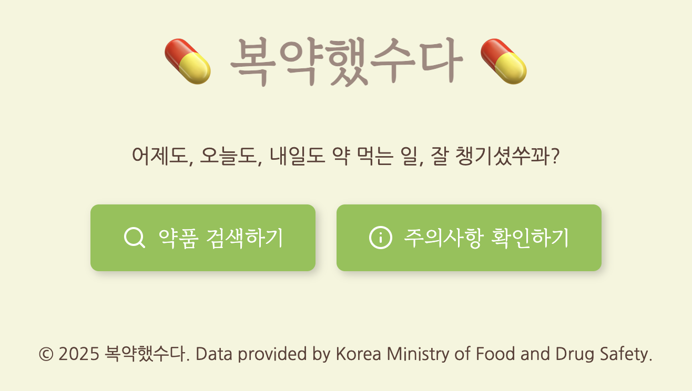

# DB_Project
2025-1학기 DB 프로젝트

# 💊 복약지도 서비스 복약했수다 (BokYak)

✔️ 이 프로젝트는 공공데이터포털의 "e약은요" API를 기반으로 복약지도를 제공하는 시스템입니다.  
✔️ 목적 : 공공데이터를 기반으로 한 정확한 의약품 정보를 쉽게 확인할 수 있는 서비스 구현

## ⚙️ 주요 기능
- 약물 검색 및 상세 정보 → done
- 복약 주의사항 제공 → done
- 사용자 약 복용 리스트 관리 x

## 🛠️ 기술 스택
- Language : Python  
- RDBMS : Local(MySQL) → OracleDB/AWS (If Deployment happens...)
- UI : Flask  

## 📆 개발 기간 및 진행상황
- 25.05.13 ~ 28.
- 각종 백엔드 구현 및 UI 1차 구현 완료 (05.16.)
- Paging 기능 구현 완료. home.html 구현 및 각종 UI 수정
- Paging 기능에 수반되는 router app.py에 추가 완료(05.20.)

## 💻 개발 환경
- OracleDB에 새로운 계정 생성 Block issue 발생, 우선 Local 환경에서 MySQL을 통해 서비스를 구현한 뒤, migration을 통해 OracleDB or AWS에 탑재 추진

## 📝 차후 과제
- ERD, WBS 시각화
- 유저 차원에서 발생할만한 불편함 조사 (현재는 Paging 기능 부재가 확인됨.) -> 완료
- 기능 수요 조사 및 적용

